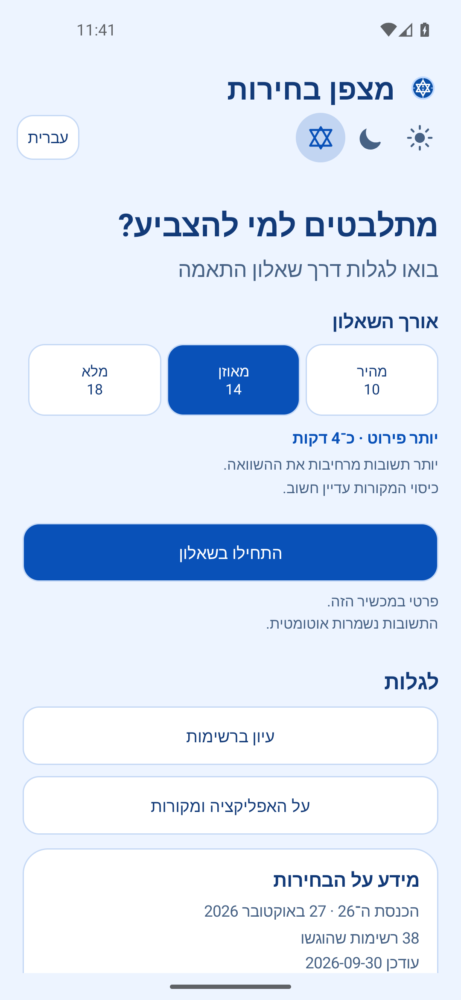
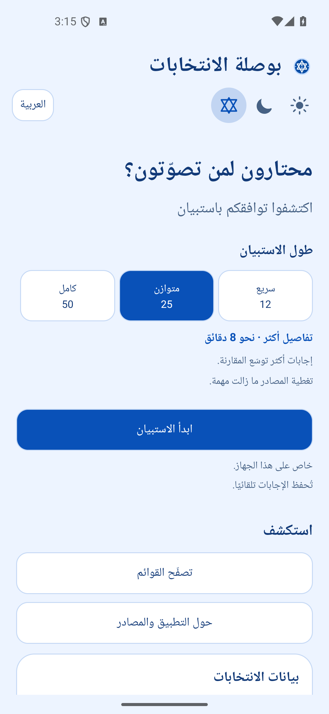
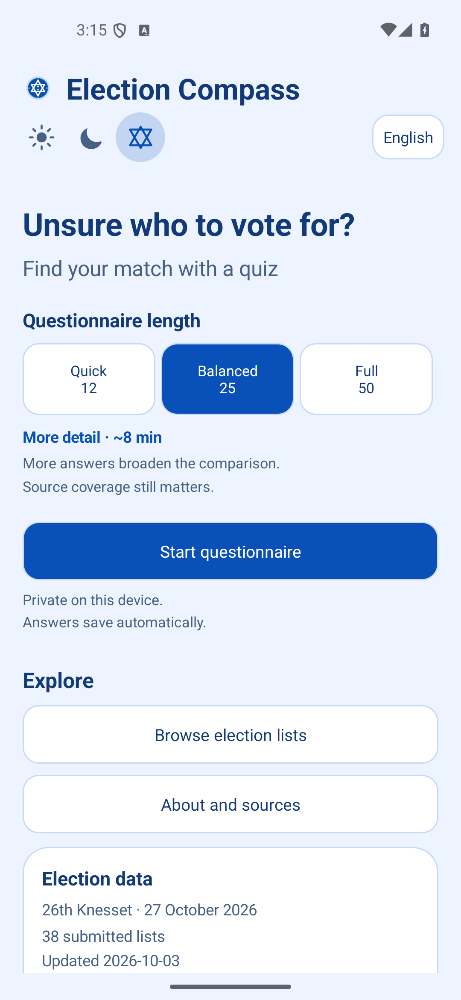
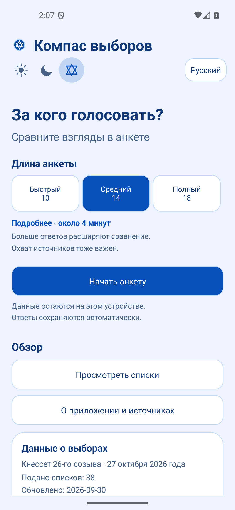

# מצפן בחירות

מצפן בחירות היא אפליקציית Android המסייעת לבוחרים בישראל להשוות בין עמדותיהם לבין **עמדות מדיניות מתועדות** של רשימות שהוגשו לבחירות לכנסת ה־26. האפליקציה אינה ממליצה להצביע לרשימה מסוימת, אינה חוזה תוצאות ואינה משתמשת בסקרים לצורך חישוב ההתאמה.

## מה אפשר לעשות באפליקציה

- לבחור אורך שאלון: מהיר (10 שאלות), מאוזן (14) או מלא (18). השאלות זמינות בעברית, בערבית, באנגלית וברוסית, עם חמש דרגות תשובה, אפשרות לדלג ועד שלוש תשובות בעדיפות כפולה. תשובות קיימות נשמרות במעבר בין אורכי השאלון.
- לראות דירוג רשימות לאחר מענה על שמונה שאלות, כאשר קיימות עמדות מתועדות המכסות לפחות 70% ממשקל התשובות. אפשר לעיין בכל הרשימות, גם כשאין די מידע כדי לדרג אותן.
- לבדוק עבור כל תוצאה את המקור, תאריך המקור והיקף העמדות המתועדות. רשימות שמעמדן נתון להכרעת בית המשפט מסומנות בהתאם.
- לשמור את התשובות במכשיר. אין צורך בחשבון, והאפליקציה אינה כוללת ניתוח שימוש או שליחת תשובות.
- להשתמש בנתוני הבחירות המצורפים גם ללא חיבור לרשת. עדכונים מתקבלים רק כאשר הם חדשים יותר וחתימתם הדיגיטלית תקינה.
- לבחור בין ערכת עיצוב בהירה, כהה או כחול־לבן באמצעות שלושה אייקונים לצד בחירת השפה. הבחירה נשמרת, וברירת המחדל בהתקנה חדשה היא ערכה כהה.
- לקרוא מסכים עם משפטים קצרים וברורים, גם בטלפונים צרים ובשפות הנכתבות מימין לשמאל.
- לפתוח את האפליקציה עם מסך פתיחה ממותג ואייקון מצפן עם מגן דוד, המופיע גם בכותרת האפליקציה.
- ליהנות מאנימציית פתיחה, מעברים בין מסכים ואפקטי מגע המתחשבים בהגדרות האנימציה של Android.
- לנווט בין שאלות, להמשיך מהתקדמות שמורה, לחפש רשימות, לעיין בתוצאות מדורגות ולא מדורגות ולהשוות תשובות מול מקורות.

[סקירת העיצוב](DESIGN_OVERVIEW.md) מפרטת את הכיוון החזותי ואת עקרונות חוויית המשתמש.

## מסך הבית

צילומי מסך מאמולטור Android 15, בערכת הצבעים כחול־לבן:

| עברית | العربية |
|:---:|:---:|
|  |  |
| **English** | **Русский** |
|  |  |

## מקור הנתונים ושיטת ההתאמה

צילום המצב המצורף לאפליקציה עובד מתוך [מצפן הבחירה 2026](https://bhirot26.online) ו[מאגר הנתונים הפתוח](https://github.com/dangelm/bhirot26-election-data), בגרסה `4b304f9983f981992ecaf5a66cfc597155745d85` מתאריך 2026-09-30, תחת רישיון [CC BY 4.0](https://creativecommons.org/licenses/by/4.0/). פירוט השינויים והקרדיט מופיעים בקובץ [DATA_LICENSE.md](DATA_LICENSE.md).

התרגום לרוסית של השאלות ושמות הרשימות מותאם לצילום המצב הזה. עדכון נתונים עתידי יכול לכלול שדות `ru` מעודכנים; בלעדיהם יוצג הנוסח האנגלי של התוכן החדש כדי שלא להציג תרגום רוסי ישן כשאלה עדכנית. ממשק האפליקציה יישאר ברוסית.

האפליקציה משתמשת ב־18 שאלות המדיניות הראשונות במאגר המקורי, ומחריגה שתי שאלות העוסקות באסטרטגיה קואליציונית. עמדות המבוססות רק על דיווח של צד שלישי אינן נכללות בחישוב. עמדה מתועדת של רשימה יכולה להיות נגד (‎-2), חלקית או מותנית (0), או בעד (2); תשובות הבוחרים נעות בין ‎-2 ל־2. עמדות לא ידועות או מוחרגות אינן משפיעות על הציון או על שיעור הכיסוי. הציון הוא ממוצע משוקלל של `100 × (1 − |תשובת הבוחר − עמדת הרשימה| / 4)` על פני השאלות שנענו ושיש להן עמדה מתועדת. תשובה שסומנה בעדיפות מקבלת משקל 2, וכל תשובה אחרת משקל 1. הציון מוצג רק לאחר שמונה תשובות וכיסוי מקורות משוקלל של לפחות 70%. רשימות בעלות ציון זהה חולקות אותו דירוג.

הנתונים משקפים מועד מסוים בלבד. מעמד הרשימות ועמדותיהן עשויים להשתנות. לפני ההצבעה יש לבדוק את קישורי המקורות ואת המידע הרשמי העדכני.

## בנייה

נדרשים JDK 21 ו־Android SDK 35. ב־Windows:

```powershell
$env:JAVA_HOME = 'C:\Program Files\Java\jdk-21'
$env:ANDROID_HOME = "$env:LOCALAPPDATA\Android\Sdk"
.\gradlew.bat assembleDebug testDebugUnitTest
```

כדי לעדכן את צילום מצב הנתונים באופן מבוקר, יש לעדכן את מזהה ה־commit המקורי ואת התרגומים בקובץ `scripts/build_content.py`, לבדוק את השינויים, להעלות את גרסת הנתונים ואת גרסת האפליקציה, להריץ `python scripts/build_content.py` ולאחר מכן `python scripts/sign_feed.py`. אין לפרסם נתונים שלא נבדקו או שאינם חתומים.

לבניית גרסה חתומה מקומית, יש להריץ `scripts/build_release.ps1`. קובץ החתימה והסיסמה המוגנת באמצעות DPAPI נמצאים מחוץ למאגר, בתיקייה `%USERPROFILE%\.android\keystores`. **יש לשמור גיבוי מאובטח של קובץ החתימה והסיסמה שלו.** עדכון האפליקציה חייב לשמור על מזהה החבילה `com.efremandrei.matzpen`, על אותו מפתח חתימה ועל `versionCode` גבוה יותר.

## עדכוני נתונים ציבוריים

GitHub Pages מגיש את הקבצים `docs/feed/manifest.json`, `manifest.sig` ו־`content.json`. האפליקציה משתמשת במפתח ציבורי שמוטמע בה כדי לאמת חתימת ECDSA P-256 ואת ערך SHA-256 של התוכן, דוחה גרסאות נתונים ישנות יותר ושומרת את העותק התקין האחרון. המפתח הפרטי לחתימת הנתונים נמצא מחוץ למאגר.

## מצב הפרויקט

גרסה 1.7.0 היא גרסת תצוגה מקדימה לקראת הבחירות, המבוססת על מקורות מתועדים. האפליקציה טרם נבדקה במכשיר Samsung פיזי. לפני הפצה רחבה נדרשת בדיקה עצמאית של תרגומי השאלות, לרבות התרגום לרוסית, ועדכוני נתוני הבחירות.
